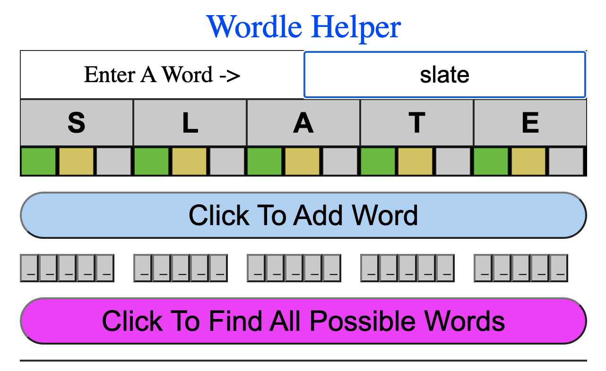
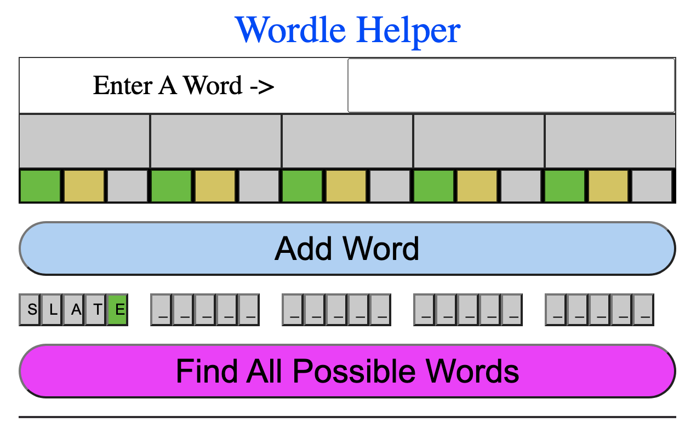
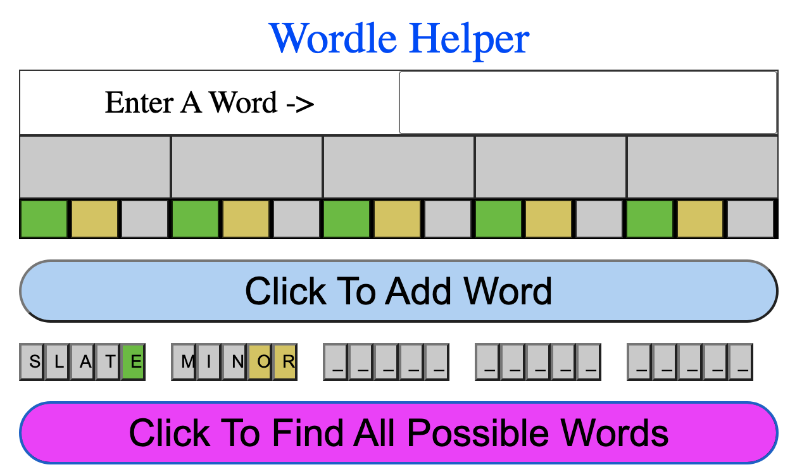
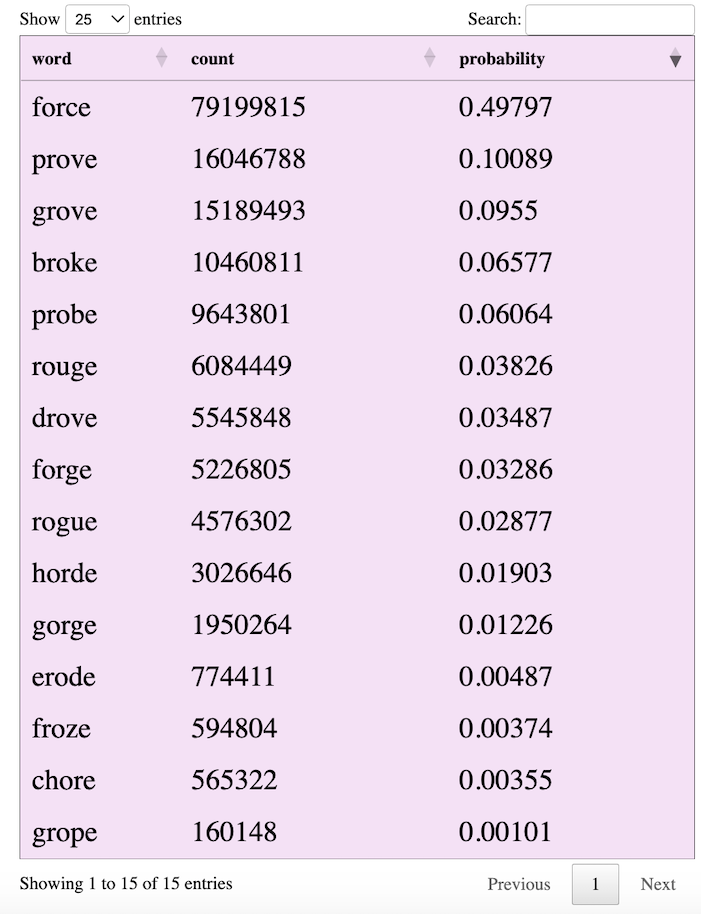
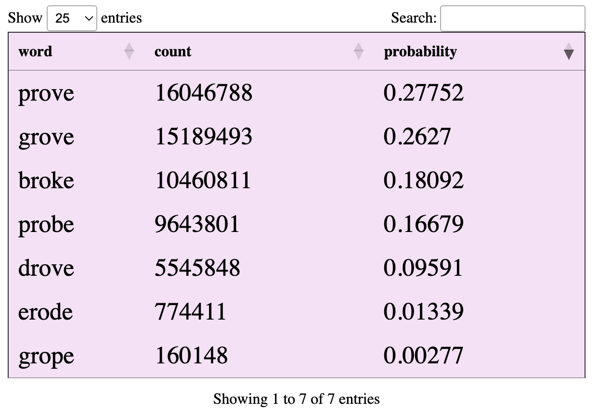
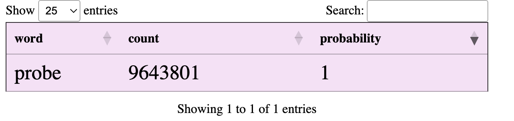

<!-- #region -->
## Wordle Cheater 
Use Wordle Helper to find possible words (e.g., *cheat*) while you're playing Wordle. 
___
## How to Cheat:
* For this example, consider the *December 16th, 2022* game.  On that day:
* The answer was the word **probe**
  * My first word that I entered in Wordle was **slate**
    * Wordle returned 
  * My next word that I entered in Wordle was **minor**
    * Wordle returned 
  * My next word was **chore**
    * Wordle returned 
___

## At this point, I started cheating by accessing the index.html page:
### http://billybyte.com/wordl/index.html


  
## I entered the word ```slate``` in the box to the right of **Enter A Word ->**


## I clicked on the ```GREEN button``` underneath the letter **E** in ```SLATE```, and the letter **E** turned GREEN.  (I left the other letters grey).


## I clicked on the ```Add A Word``` button, which added the word ```SLATE``` below the button.


## I repeated the same process for the word ```minor```:
* Enter minor in the box to the right of **Enter A Word ->**
* Click on the GOLD color for the **O**
* Click on the GOLD color for the **R**
* Click the **Add A Word** button
  

## Now I hit ```Find All Possible Words``` (i.e., I cheated):


## The most probable word was ```force```, so I entered that:
* Wordle returned 


## ```Find All Possible Words``` returned:


## The most probable word was ```prove```, so I entered that:
* Wordle returned 

## ```Find All Possible Words``` returned:


## This showed ```probe``` as the only possible solution, which was the actual Wordle solution.

<!-- #endregion -->

```python

```
